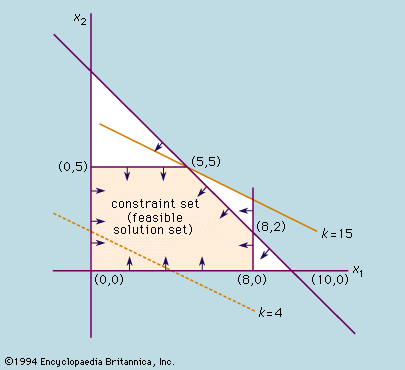
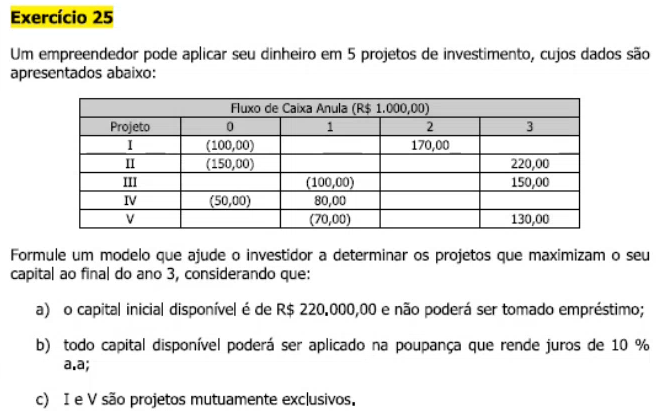

# Aula 2 - Simplex

## Índice

1. Problema de Programação Linear
2. Solução ótima
3. Método Simplex
4. Programação Linear Inteira Mista (PLIM)

## 1. Problema de Programação Linear

Um problema de programação linear é um problema da forma:

* Função objetivo
* Restrição 1
* ...
* Restrição m

Ou, de forma mais específica:

* $Max Z = y_0 + y_1x_1 + \ldots + y_nx_n$ (a função objetivo também pode ser de minimizar)
* $a_0 + a_1x_1 + \ldots + a_nx_n <= 0$
* $\ldots$
* $m_0 + m_1x_1 + \ldots <= 0$

Onde $x_1, \ldots, x_n$ são variáveis e $a_i, b_i, \ldots, m_i, y_i$ são constantes para todo i.

## 2. Solução ótima

* **Solução:** combinação de valores $x_1, \ldots, x_n$ que atende a todas as restrições.
* **Solução ótima:** é a melhor solução. Isto é, a combinação de valores $x_1, \ldots, x_n$ que atende às restrições e maximiza / minimiza a função objetivo.

Pode ser que não exista nenhuma solução para o problema. Da mesma forma, podem haver uma ou várias soluções.
Inclusive, podem haver uma ou várias soluções ótimas.

De forma geral, num problema de programação linear, queremos encontrar as soluções ótimas. Uma das formas de fazer isso é por meio do método Simplex.

## 3. Método Simplex

O primeiro pré-requisito para encontrarmos as soluções de um problema de programação linear é delimitarmos o espaço que atende a todas as restrições.
Num exemplo em $R^2$, podemos ver isso da seguinte forma:

Na imagem acima, as restrições são dadas pelas retas e pelas setas. As setas indicam em qual lado da reta as soluções precisam estar.
A área delimitada por todas as retas com suas setas é a região de R2 que atende todas as restrições.

O método Simplex nos diz que a solução ótima é um dos vértices da região delimitada. Nesse caso, os seguintes candidatos a solução ótima são os pontos:

* (0,0)
* (0,5)
* (5,5)
* (8,2)
* (8,0)

A solução ótima vai depender de qual é a função objetivo. Por exemplo, se a função objetivo fosse:

$$Max Z(x_1, x_2) = 5 + 1 \cdot x_1 - 2 \cdot x_2$$

então teríamos os valores:

* $Z(0,0) = 5 + 1 \cdot 0 - 2 \cdot 0 = 5$
* $Z(0,5) = 5 + 1 \cdot 0 - 2 \cdot 5 = -5$
* $Z(5,5) = 5 + 1 \cdot 5 - 2 \cdot 5 = 0$
* $Z(8,2) = 5 + 1 \cdot 8 - 2 \cdot 2 = 9$
* $Z(8,0) = 5 + 1 \cdot 8 - 2 \cdot 0 = 13$

Sendo assim, a solução ótima nesse caso seria $(x_1, x_2) = (8, 0)$, pois com esse ponto maximizamos a função objetivo.

Resumindo, o Método Simplex funciona assim:

* Determinar a região poligonal que atende a todas as restrições
* Aplicar todos os vértices na função objetivo
* O valor que maximizar / minimizar a função objetivo é o valor ótimo

## 4. Programação Linear Inteira Mista (PLIM)

* **Programação Linear Inteira:** envolve os problemas de programação linear onde as variáveis podem assumir somente valores inteiros.
Por exemplo, se as variáveis simbolizarem pessoas, então precisam obrigatoriamente ser inteiras.

* **Programação Linear Inteira Mista (PLIM):** são problemas de programação linear inteira onde existem variáveis de mais de um formato. Por exemplo: variáveis inteiras e binárias.

Vejamos um exemplo de problema de PLIM:

A primeira etapa é definir as variáveis de decisão:

* $x_i = 1$, se o projeto for selecionado e $x_i = 0$, caso contrário (binária)
* $p_j$ é a quantidade investida na poupança no período j = 0, 1, 2, 3 (inteira)

Agora, vamos definir a função objetivo e as variáveis de restrição:

* Restrições

$$
\begin{align}
    
100 \cdot x_1 + 150 \cdot x_2 + 50 \cdot x_4 + p_0 & = 220 \\
100 \cdot x_3 + 70 \cdot x_5 + p_1 & = 80 \cdot x_4 + 1,1 \cdot p_0 \\
p_2 & = 170 \cdot x_1 + 1,1 \cdot p_1 \\
x_1 + x_5 & <= 1

\end{align}
$$

* $x_i$ é binário
* $p_j >= 0$

As restrições, nessa respectiva ordem, significam o seguinte:

* No momento 0, vou investir exatamente 220 mil distribuídos nos investimentos $x_1, x_2, x_4$ e poupança (p_0)
* No momento 1, terei 80 mil caso eu tenha investido em $x_4$ e terei o montante da poupança que rendeu $10%$. Poderei investir esse dinheiro em $x_3, x_5$ e poupança (p_1)
* No momento 2, terei $170$ mil caso eu tenha investido em $x_1$ somado ao montante que deixei na poupança no momento $p_1$ acrescido de $10%$. Só poderei investir esse dinheiro na poupança (p_2).

* Função objetivo:

$$Max Z = 220 \cdot x_2 + 150 \cdot x_3 + 130 \cdot x_5 + 1,1 \cdot p_2\$$

