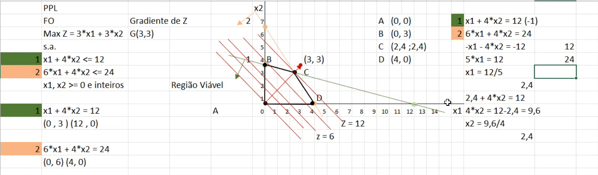

# Aula 3 - Modelagem Inteira

## Índice

1. Solução analítica / Método Gráfico
2. Funcionamento do Simplex

## 1. Solução analítica / Método Gráfico

Seja o seguinte problema de programação linear:

$$ Max Z = 3 \cdot x_1 + 3 \cdot x_2 $$

sujeito a:

$$ x_1 + 4 \cdot x_2 <= 12 $$
$$ 6 \cdot x_1 + 4 \cdot x_2 <= 24 $$

$x_1, x_2$ inteiros.

Para resolvê-lo, primeiro precisamos traçar as duas retas das restrições.
Faremos isso encontrando 2 pontos pelos quais cada reta passa.
A forma mais simples de fazer isso é substituir $x_1 = 0$ para obter $x_2$ e vice-versa, em cada uma das equações envolvidas.

Com isso, obtemos que a primeira reta passa por (0,3) e (12,0), enquanto a segunda reta passa por (0,6) e (4,0).

Em segundo lugar, identificamos qual é o semiplano que satisfaz a restrição, em cada reta. Isto é, a reta divide o plano em 2 partes, queremos achar qual parte satisfaz a desigualdade envolvida.

Para fazer isso, basta tomar qualquer ponto de um dos lados da reta. Se esse ponto satisfizer a restrição, então esse lado é o lado correto, se não, é o outro lado. Identificamos isso com uma seta em cada reta.

Fazendo isso, obtemos a região viável, que atende a todas as restrições, conforme a imagem abaixo:

Igualando as equações das retas, conseguimos obter todos os pontos que são os vértices da região viável, como na imagem:

Os vértices são:

* A (0,0)
* B (0,3)
* C (2,4; 2,4)
* D (4,0)

Já foi provado que a solução ótima é um dos vértices da região viável. Sendo assim, podemos seguir duas abordagens para encontrar a solução ótima:

1. Testar todos os pontos na função objetivo e ver qual deles a maximiza
2. Calcular o gradiente de Z (Grad(Z) = (3,3)) e ver qual vértice está em uma curva de nível maior, segundo o gradiente

De qualquer das duas formas, concluímos que o ponto C (2,4; 2,4) é a solução ótima, que resulta em Z = 14.

## 2. Funcionamento do Simplex

Agora, vamos resolver exatamente o mesmo problema. Porém, seguindo o algoritmo do Simplex, para entender o seu funcionamento.