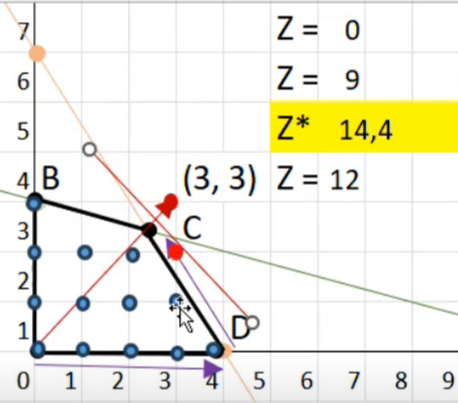
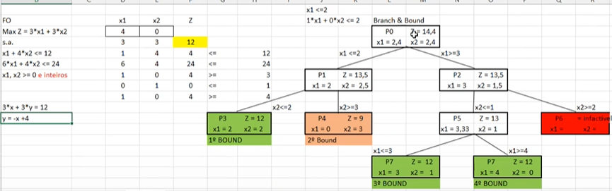
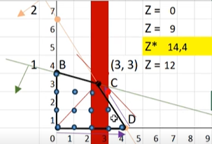
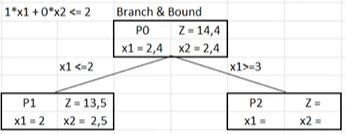
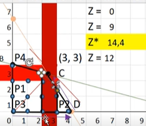
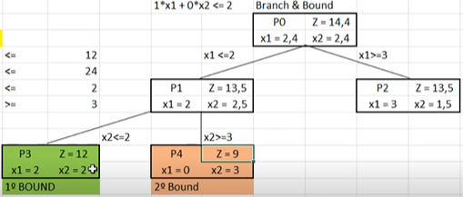
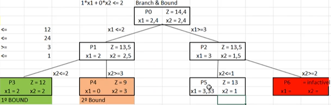
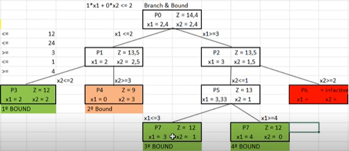

# Aula 4 - Branch And Bound

## Índice

1. Introdução
2. Branch and Bound

## 1. Introdução

Nesta aula, será resolvido o mesmo problema da aula anterior. Porém, agora vamos considerar a restrição das variáveis inteiras.

Por conta disso, adotaremos o método Branch and Bound para resolver.

## 2. Branch and Bound

Note que, na imagem abaixo, temos a região viável do problema da aula anterior, mas temos pontos azuis simbolizando soluções inteiras.

Queremos escolher a solução inteira que maximiza a função objetivo. Visualmente, a solução ótima parece ser um dos pontos: (3,1) ou (2,2).

Podemos até colocar esses 2 pontos na função objetivo:

$$Z = 3 \cdot x_1 + 3 \cdot x_2$$

* $Z(3,1) = 3\cdot 3 + 3 \cdot 1 = 12$
* $Z(2,2) = 3\cdot 2 + 3 \cdot 2 = 12$

Então, aparentemente esses 2 pontos servem como solução do problema, pois estão na mesma curva de nível e - aparentemente - estão na maior curva de nível dentre as soluções inteiras.

Agora, vamos ver com o Método Branch and Bound qual é a solução do problema.

O Método Branch and Bound consiste em - após obter uma solução relaxada para o problema, isto é, uma solução decimal - dividir a região viável iterativamente de forma que obteremos as soluções inteiras, caso elas existam.

Então, estávamos resolvendo esse problema:

$$
\begin{align*}

& Max Z = 3 \cdot x_1 + 3 \cdot x_2 \\
& s.a. \\
& x_1 + 4 \cdot x_2 <= 12 \\
& 6 \cdot x_1 + 4 \cdot x_2 <= 24 \\
& x_1, x_2 \text{ inteiros} 

\end{align*}
$$

E já temos a solução relaxada $x_1 = 2,4$ e $x_2 = 2,4$, que gera $Z = 14,4$.

Primeiro, escolhemos a variável da solução relaxada que tem a parte decimal mais próxima de 0,5 para começarmos a abrir os nós da árvore. Como temos $x_1 = x_2$, vamos escolher $x_1$ e separar o problema em 2:

* P1: $x_1 <= 2$
* P2: $x_1 >= 3$

Com isso estamos removendo a região vermelha:

Feito isso, resolvemos novamente o problema usando o Simplex com essas novas restrições:

Note que a solução obtida em P1 ainda não é uma solução inteira, pois obtemos $x_2 = 2,5$.

Então vamos fazer a próxima divisão:

* P3: $x_1 <= 2$ e $x_2 <= 2$
* P4: $x_1 <= 2$ e $x_2 >= 3$

O que é o mesmo que remover a área vermelha horizontal:

Resolvendo P3 e P4 obtemos duas soluções inteiras, então dizemos que obtemos os 2 primeiros bounds. Já descartamos o segundo bound porque o valor obtido nele é menor do que no primeiro.

Agora, vamos abrir o outro lado do problema P0:

Ainda não obtivemos uma solução inteira, então vamos abrir outro nó:

* $x_1 > 3$ e $x_2 <= 1$
* $x_1 > 3$ e $x_2 >= 2$

Nesse caso, P6 é infactível e P5 não teve solução inteira. Vamos abrir P5 em 2 novos problemas:

* $x_1 >=3$ e $x_2 <= 1$ e $x_1 <= 3$
* $x_1 >=3$ e $x_2 <= 1$ e $x_1 <= 3$

Resolvendo isso, obtemos os últimos bounds:

E agora, finalizamos o problema. Olhando para todos os bounds, chegamos à conclusão que temos 3 soluções ótimas:

* P3 $(2,2)$
* P7 $(3,1)$
* P8 $(4,0)$

As 3 geram Z = 12.
